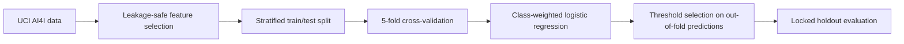
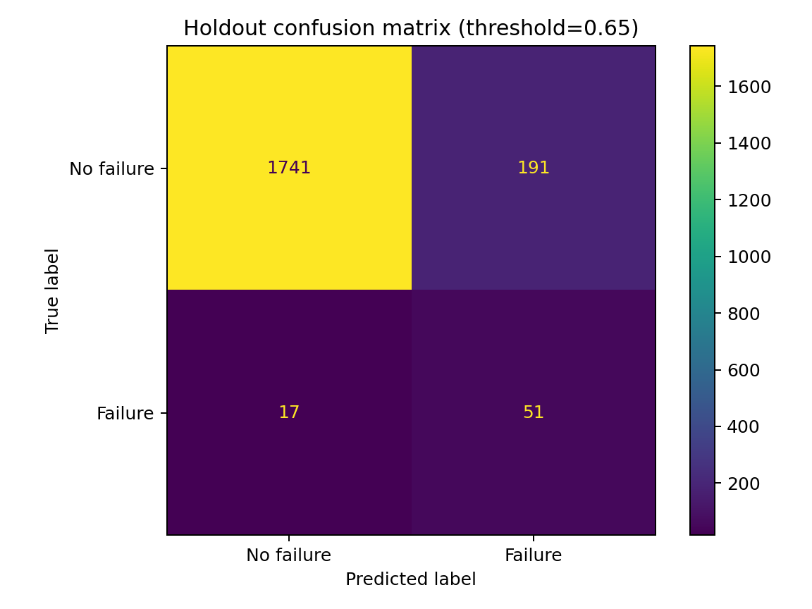

# Predictive Maintenance Failure Classifier

[](https://github.com/Tansari2004/predictive-maintenance-classifier/actions/workflows/ci.yml)
[](https://www.python.org/downloads/)
[](LICENSE)

A reproducible machine-learning case study using the UCI AI4I 2020 Predictive Maintenance dataset. The project focuses on the operational trade-off between catching failures and generating too many false alarms.

## Project question

Can a class-weighted model identify likely machine failures early enough for review while keeping the false-positive rate manageable?

## Dataset

The [AI4I 2020 Predictive Maintenance dataset](https://archive.ics.uci.edu/dataset/601/ai4i+2020+predictive+maint) contains 10,000 synthetic manufacturing records and is licensed CC BY 4.0.

The model uses the six operational features available before the outcome:

- product type;
- air temperature;
- process temperature;
- rotational speed;
- torque; and
- tool wear.

Identifiers and the five failure-mode columns are excluded to prevent leakage into the overall `Machine failure` target.

## Method



The decision threshold is selected using out-of-fold training predictions. The objective is to maximize failure recall while respecting a configurable maximum false-positive rate. The holdout set stays untouched until final evaluation.

## Reproduce the analysis

```bash
python -m venv .venv
source .venv/bin/activate
pip install -r requirements.txt
python -m src.train
pytest
```

The training command downloads the official UCI CSV, writes metrics to `results/metrics.json`, and saves a confusion matrix to `results/confusion_matrix.png`.

## Results

Run `python -m src.train` to reproduce the current numbers. The checked-in metrics were generated with random seed 42 and an 80/20 stratified split.

<!-- RESULTS_START -->
On the 2,000-row holdout set (68 failures), the selected threshold was **0.655**:

| Metric | Result |
|---|---:|
| Failure recall | 75.0% |
| Precision | 21.1% |
| False-positive rate | 9.9% |
| PR AUC | 0.382 |
| ROC AUC | 0.907 |

The model caught 51 of 68 failures, missed 17 and produced 191 false alarms. Those numbers make the operational trade-off explicit: the model is a screening tool whose threshold should be set with maintenance capacity and failure cost in mind.


<!-- RESULTS_END -->

Because machine failures are rare, accuracy alone is not a useful success measure. The report emphasizes recall, precision, false-positive rate, PR AUC and the confusion matrix.

## Repository structure

```text
src/data.py       Download and validate the UCI dataset
src/train.py      Cross-validation, threshold selection and evaluation
tests/            Unit tests for data and threshold logic
results/          Reproducible metrics and confusion matrix
```

## Limitations

- The data is synthetic and does not represent a deployed factory.
- A threshold appropriate for one operation may be unacceptable in another.
- Real deployment would require cost estimates, drift monitoring, maintenance feedback and prospective validation.

## License and citation

Code is licensed under the [MIT License](LICENSE). The dataset is provided by UCI under CC BY 4.0:

> Matzka, S. (2020). AI4I 2020 Predictive Maintenance Dataset. UCI Machine Learning Repository. https://doi.org/10.24432/C5HS5C
